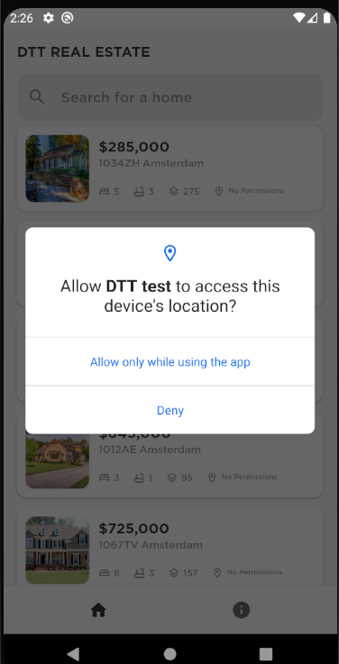
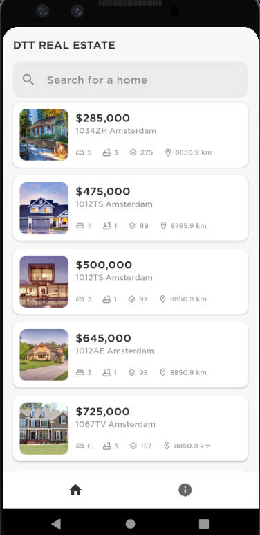
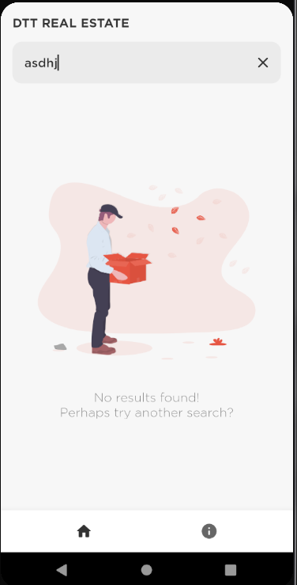
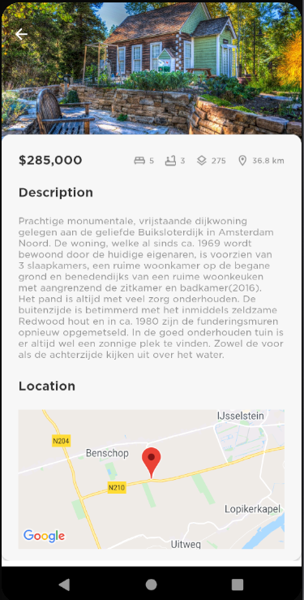
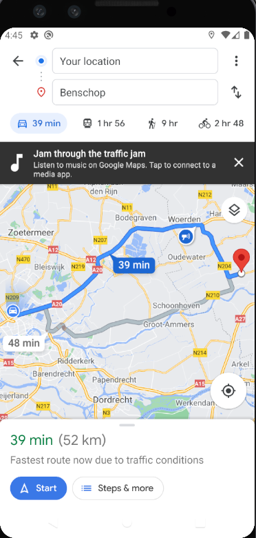

### Real Estate app

App that displays houses for sale. It displays an image, their price, address, amount of bedrooms and bathrooms, size and distance based on the user's current location.
Tech stack: MVVM, Retrofit, Glide and Google Maps API. 

When the app gets started a splash screen is displayed

The first thing you need to do is allow or deny access to the device's location. It is necessary if you want to know the distance between you and the house.

This view displays an overview of the houses with a search bar on top.

You can use the search bar to filter for houses by address or zip code. If no result matches, this screen is displayed.

When you click on a item, you move to detailed view with a bigger picture, a description and a marker with its location in the map.

If you click on the map inside the detailed view you'll get redirected to Google Maps to get directions

The other bottom navigation button is just a static view with some fictional info about the development team

