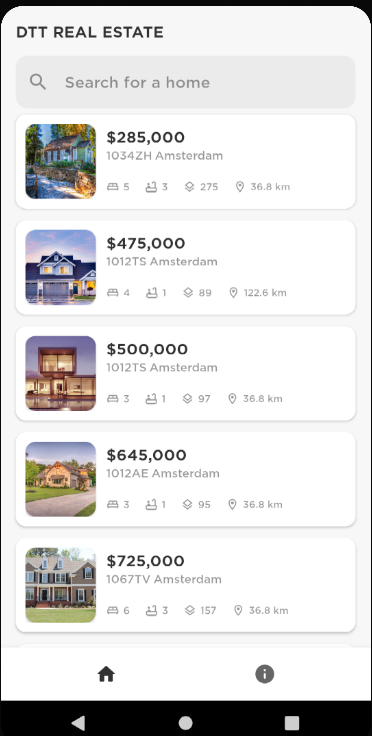

### Real Estate app

App that displays houses for sale. It displays an image, their price, address, amount of bedrooms and bathrooms, size and distance based on the user's current location.

When the app gets started a splash screen is displayed

The first thing you need to do is allow or deny access to the device's location. It is necessary if you want to know the distance between you and the house.

This view displays an overview of the houses with a search bar on top.

When you click on a item, you move to detailed view with a bigger picture, a description and a marker with its location in the map.

